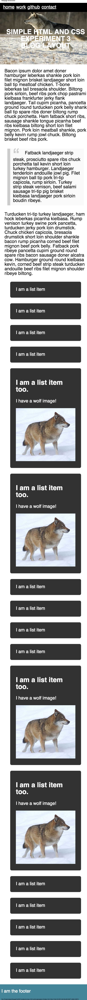

# simple-html-and-css

Adapt the HTML and CSS to match this design:

The stuff you'll stumble on and learn this week includes:
- *nav* element and styling inline lists
- full screen hero image styling
- centering text (vertically and horizontally)
- *blockquote* element and styling with oversized quote

HINT:
- box-sizing: border-box;
- re-use week-2's float layout for .side elements
- mobile-first approach
- position: absolute and transform: translate for centering .hero-text

Resources:
- http://css-tricks.com/box-sizing/
- http://zerosixthree.se/vertical-align-anything-with-just-3-lines-of-css/
- http://css-tricks.com/snippets/css/simple-and-nice-blockquote-styling/
- http://validator.w3.org/nu/
- https://jigsaw.w3.org/css-validator/